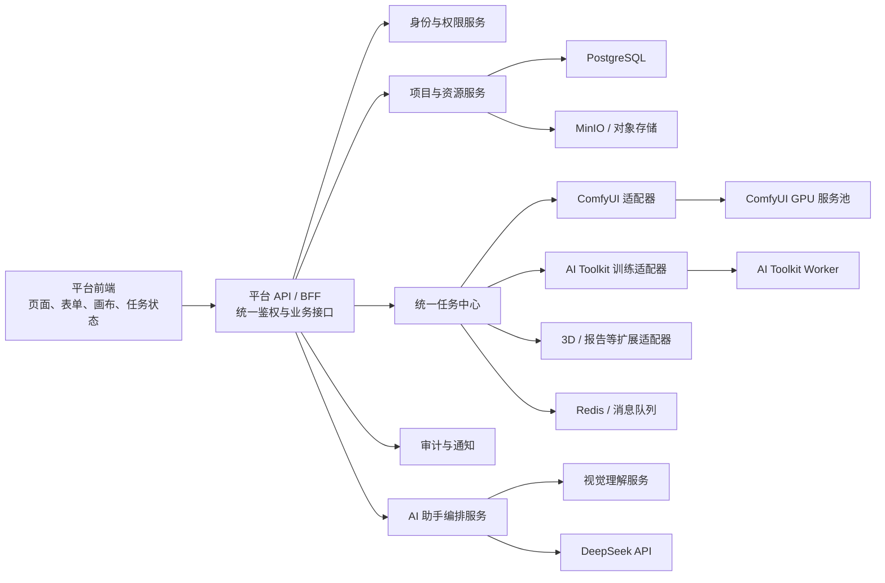
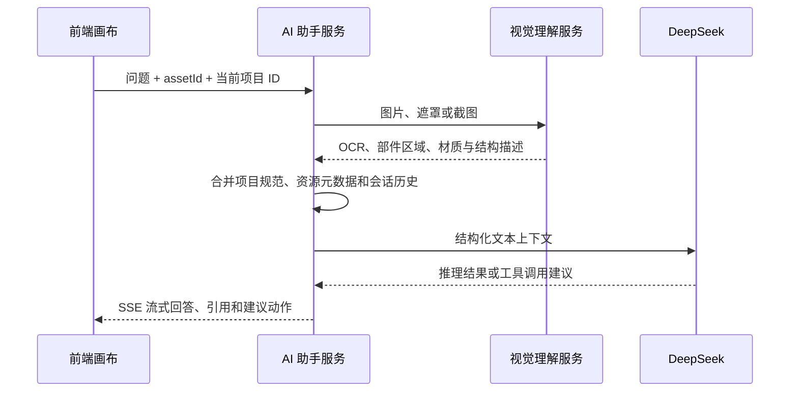

# 轨道交通客室智能快速设计工具架构设计说明

## 1. 文档目的

本项目面向轨道交通客室设计师，目标是把多个 AI 能力封装成统一、可管理的设计工作台。当前 UI Demo 用于确认产品信息架构和交互方式；正式开发需要在不推翻页面框架的前提下，对接已部署的 ComfyUI 工作流、LoRA 训练服务、AI 聊天助手以及平台自身的登录、用户、权限、项目和资源服务。

本文档用于回答以下问题：

- 当前项目究竟要建设什么。
- 前端、平台后端和模型服务分别负责什么。
- 三类主要 AI 服务如何接入。
- 页面如何保持独立于具体 API 和模型实现。
- 后续团队应按什么接口、状态和权限协议开发。

## 2. 项目范围

### 2.1 平台业务模块

- 登录、用户、角色和权限管理。
- 首页、项目上下文和全局任务状态。
- 客室效果生成、CMF 生成、零部件生成等工作流功能。
- 图像遮罩、屏幕捕捉、参考图和多模态输入。
- LoRA 数据集、训练任务、模型发布和模型库。
- 2D 生 3D、自动报告、资源库等扩展业务。
- AI 设计助手、标准问答、提示词辅助和报告摘要。

### 2.2 主要外部能力

1. ComfyUI：执行多个已发布的生成工作流。
2. AI Toolkit：执行 LoRA 训练、监控训练任务并产出模型文件。
3. DeepSeek：承担文本推理、对话、结构化输出和工具调用。
4. 视觉理解服务：承担图片识别、OCR、区域理解和画布内容提取。

当前 DeepSeek 官方 API 文档主要展示文本输入。多模态能力不应假设由单一 DeepSeek 接口完成，应将视觉理解与语言推理解耦。

## 3. 核心设计原则

### 3.1 前端不直连模型服务

浏览器只调用本项目的平台 API。ComfyUI 地址、AI Toolkit Token、DeepSeek API Key、GPU 节点地址和工作流 JSON 均由后端管理。

### 3.2 UI 依赖业务语义，不依赖底层实现

前端提交 `prompt`、`referenceImages`、`width`、`height`、`loraIds` 等业务字段。ComfyUI 节点编号、AI Toolkit YAML 字段和 DeepSeek 模型名称不得写死在页面组件中。

### 3.3 所有耗时能力使用统一任务协议

生成、训练、3D 重建和报告生成统一表现为异步任务。任务拥有排队、运行、成功、失败、取消等状态，前端复用同一套任务队列、通知和错误处理组件。

### 3.4 业务资产统一沉淀

输入图片、遮罩、生成结果、LoRA 模型、3D 模型和报告都登记为平台资源，归属于项目、创建人和权限范围，不能只保存在各模型服务的本地目录中。

### 3.5 工作流和模型必须版本化

每次任务记录所使用的工作流版本、基础模型、LoRA 版本、输入参数和输出资源。管理员发布新版本不能影响历史任务追溯。

## 4. 总体逻辑架构



## 5. 服务边界

| 服务 | 主要职责 | 不应承担的职责 |
| --- | --- | --- |
| 平台前端 | 页面布局、交互、表单校验、任务状态展示 | 保存密钥、拼装 ComfyUI 节点、启动训练进程 |
| 平台 API / BFF | 鉴权、聚合数据、业务接口、服务适配 | 直接执行 GPU 推理 |
| 身份权限服务 | 登录、会话、用户、角色、权限、审计 | 管理模型文件 |
| 项目资源服务 | 项目、素材、版本、共享、对象存储 | 执行工作流 |
| 统一任务中心 | 排队、状态、进度、取消、重试、通知 | 理解具体页面布局 |
| ComfyUI 适配器 | 工作流装配、图片上传、提交、进度和结果转换 | 暴露节点编号给前端 |
| 训练适配器 | 数据集打包、配置生成、训练进程、日志和产物 | 承担平台用户登录 |
| AI 助手编排 | 会话、上下文、RAG、视觉结果、DeepSeek 调用 | 将 API Key 下发浏览器 |

## 6. 统一 API 规范

### 6.1 基础约定

- 统一前缀：`/api/v1`。
- 登录建议使用 HttpOnly、Secure Cookie 或短期 Access Token 加刷新机制。
- 所有接口返回稳定的业务错误码和 `requestId`。
- 文件先上传到资源服务，业务接口传递 `assetId`，不传本地路径。
- 所有写操作记录操作者、项目、时间、请求摘要和结果。

### 6.2 统一任务对象

```json
{
  "jobId": "job_01JXYZ",
  "type": "comfy_workflow",
  "status": "running",
  "progress": 66,
  "stage": "正在执行图像解码",
  "projectId": "project_001",
  "createdBy": "user_001",
  "outputs": [],
  "error": null,
  "createdAt": "2026-07-12T10:00:00+08:00"
}
```

状态统一为：`queued`、`running`、`succeeded`、`failed`、`cancelled`。

建议接口：

```http
POST /api/v1/jobs
GET  /api/v1/jobs/{jobId}
POST /api/v1/jobs/{jobId}/cancel
POST /api/v1/jobs/{jobId}/retry
GET  /api/v1/jobs/{jobId}/events
```

`events` 建议使用 SSE。平台后端内部可使用 WebSocket、消息队列或轮询与模型服务通讯，但前端只依赖统一 SSE 协议。

## 7. ComfyUI 工作流接入

### 7.1 工作流发布流程

1. 管理员在 ComfyUI 页面编辑和调试节点工作流。
2. 通过 `Export Workflow (API)` 导出 API 格式 JSON。
3. 管理员在平台后台上传 API JSON，并配置业务参数 Schema。
4. 后端验证节点、模型和自定义节点是否可用。
5. 保存为工作流草稿版本，测试通过后发布。
6. 普通用户只能调用已发布版本。

ComfyUI API 格式使用数字节点 ID、`class_type` 和 `inputs`，不会包含节点坐标和颜色等 UI 元数据。正式系统应保存 API 格式，而不是普通保存格式。

### 7.2 工作流注册中心

建议保存以下字段：

```text
workflowKey        cabin-render
version            1.3.0
status             draft / published / retired
workflowJson       ComfyUI API JSON
inputSchema        前端业务字段 Schema
nodeMappings       业务字段到节点 input 的映射
outputMappings     输出节点与资源类型映射
requiredModels     Checkpoint、VAE、LoRA、自定义节点
publishedBy        管理员 ID
publishedAt        发布时间
```

示例映射由后端维护：

```json
{
  "prompt": "6.inputs.text",
  "negativePrompt": "7.inputs.text",
  "seed": "3.inputs.seed",
  "width": "5.inputs.width",
  "height": "5.inputs.height"
}
```

前端只获取 `inputSchema` 并生成表单，不读取 `nodeMappings`。

### 7.3 执行流程

1. 上传参考图或遮罩，获得平台 `assetId`。
2. 前端提交 `workflowKey`、版本或 `latestPublished`、项目和业务输入。
3. 适配器下载输入资源，并调用 ComfyUI `/upload/image` 或 `/upload/mask`。
4. 适配器复制已发布工作流 JSON，按照映射写入本次输入。
5. 调用 `/prompt` 提交工作流，记录返回的 `prompt_id`。
6. 通过 `/ws` 获取执行进度和错误，也可使用 `/queue`、`/history/{prompt_id}` 查询。
7. 通过 `/view` 获取结果，上传到平台对象存储并登记资源。
8. 平台任务中心向前端发送统一状态。

## 8. LoRA 训练服务接入

AI Toolkit 自带 UI 可启动、停止和监控训练任务，但正式平台不应直接嵌入它的 WebUI。建议将 AI Toolkit 部署成受平台控制的 Worker，外层建设 `training-service`。

### 8.1 训练接口

```http
POST /api/v1/training-datasets
GET  /api/v1/training-datasets/{id}
POST /api/v1/training-jobs
GET  /api/v1/training-jobs/{id}
GET  /api/v1/training-jobs/{id}/logs
POST /api/v1/training-jobs/{id}/cancel
GET  /api/v1/training-jobs/{id}/artifacts
POST /api/v1/training-jobs/{id}/publish
```

### 8.2 后端职责

- 校验图片、同名标注文件、触发词、分辨率和数据量。
- 将前端参数转换成经过白名单验证的 AI Toolkit YAML。
- 启动独立训练进程或容器，记录 PID、GPU、日志和 checkpoint。
- 支持停止、失败诊断、断点续训和存储配额。
- 训练完成后将模型文件上传对象存储并登记模型版本。
- 发布 LoRA 后同步到 ComfyUI 模型目录或模型分发服务。

AI Toolkit 文档说明其 UI 只需要用于启动、停止和监控任务，任务本身不依赖 UI 持续运行。该特性适合由平台服务包装。

## 9. AI 助手与 DeepSeek 接入

### 9.1 接口边界

```http
POST /api/v1/assistant/sessions
GET  /api/v1/assistant/sessions/{id}
POST /api/v1/assistant/sessions/{id}/messages
GET  /api/v1/assistant/sessions/{id}/events
POST /api/v1/assistant/sessions/{id}/attachments
```

DeepSeek API 使用 OpenAI 或 Anthropic 兼容格式，密钥和模型名称必须保存在服务端配置中。模型名称不可写死在前端。

### 9.2 多模态拆分



DeepSeek 对话接口是无状态的，因此会话历史、项目上下文和引用资源由平台保存。若需要助手直接发起生成任务，应通过工具调用进入平台任务 API，并在真正执行前要求用户确认。

## 10. 平台基础服务

### 10.1 登录与用户

- 登录、退出、刷新会话、密码策略和验证码。
- 用户启用、停用、角色分配和部门信息。
- 会话过期和单点登录能力预留。

### 10.2 权限模型

初版建议使用 RBAC，并叠加资源所有权：

| 能力 | 管理员 | 普通设计师 |
| --- | --- | --- |
| 调整 ComfyUI 工作流 | 允许 | 不可见 |
| 发布工作流版本 | 允许 | 不允许 |
| 调用已发布工作流 | 允许 | 允许 |
| 创建 LoRA 训练 | 允许 | 按权限开放 |
| 发布 LoRA | 允许 | 不允许或需审批 |
| 管理全部资源 | 允许 | 不允许 |
| 管理本人资源 | 允许 | 允许 |
| 查看共享资源 | 允许 | 允许 |
| 用户和角色管理 | 允许 | 不允许 |

后端必须校验权限，前端隐藏按钮只用于体验，不能作为安全边界。

### 10.3 项目与资源

资源至少包含：`image`、`mask`、`material`、`lora`、`model3d`、`report`、`workflowOutput`。每个资源保存项目、创建人、来源任务、文件版本、共享范围、标签和审计信息。

## 11. 前端工程架构

推荐使用 TypeScript。若团队没有既有技术栈，可采用 Vue 3 + Vite + Vue Router + Pinia + Vue Query；React 也可使用同样的模块边界。

```text
src/
  app/                 应用壳、路由、权限守卫、全局错误处理
  modules/
    auth/              登录与会话
    users/             用户、角色和权限
    projects/          项目上下文
    generation/        客室、CMF、零部件等生成页面
    training/          数据集、训练、模型发布
    assistant/         AI 助手与画布引用
    resources/         资源库
    admin-workflows/   工作流导入、测试、发布和版本
    reports/           报告生成
  components/          通用表单、画布、上传、任务卡、弹窗
  services/
    http/              HTTP 客户端、错误码和拦截器
    jobs/              统一任务与 SSE
    generated/         由 OpenAPI 生成的类型化客户端
  stores/              会话、项目、通知和任务状态
  styles/              Token、布局和组件样式
```

建议抽象以下前端接口：

```ts
interface GenerationService {}
interface TrainingService {}
interface AssistantService {}
interface ResourceService {}
interface IdentityService {}
interface JobService {}
```

开发阶段使用 Mock 实现，联调阶段替换为 HTTP 实现，页面组件不需要改写。

## 12. API 范围标注模式

当前 Demo 可增加仅用于汇报和开发的“架构标注模式”：

- 工作流 Tab 和生成页面：`comfy-workflow`。
- LoRA 入口和训练页面：`training-service`。
- AI 悬浮入口和抽屉：`assistant-service`。
- 登录、用户、通知、项目和资源库：`platform-service`。

代码通过 `data-service-scope` 标注，CSS 仅在 `body.architecture-mode` 下显示虚线框和服务标签。生产环境默认关闭，避免把技术说明暴露给最终用户。

## 13. 部署建议

```text
Nginx / API Gateway
  frontend-web
  platform-api
    identity
    project-resource
    job-orchestrator
    workflow-registry
    assistant-orchestrator
  workers
    comfy-adapter -> ComfyUI GPU 容器池
    training-adapter -> AI Toolkit GPU 容器池
    report-adapter
    model3d-adapter
  infrastructure
    PostgreSQL
    Redis / 消息队列
    MinIO
    日志与监控
```

开发、测试和生产环境分别配置服务地址。所有密钥放入服务端 Secret 管理，不能进入前端构建产物或 Git。

## 14. 可观测性与安全

- 每个请求和任务生成 `requestId`、`jobId`，贯穿前端、平台和 Worker 日志。
- 记录 GPU 节点、工作流版本、模型版本、执行耗时、错误节点和资源输出。
- 上传文件做扩展名、MIME、大小和内容检查。
- 训练配置使用字段白名单，禁止前端提交任意命令或文件路径。
- API 做限流、配额、超时、取消和重试控制。
- DeepSeek、ComfyUI 和 AI Toolkit 密钥只存在于服务端。
- 对工作流发布、模型发布、资源共享和权限变更保留审计记录。

## 15. 关键技术决策

1. 正式系统不 iframe 嵌入 ComfyUI 或 AI Toolkit 页面。
2. 普通用户看不到节点图，只使用业务表单。
3. 管理员在独立后台管理工作流和模型发布。
4. 前端通过后端提供的 Schema 动态渲染工作流参数。
5. 所有耗时任务使用统一任务协议。
6. 多模态助手拆分视觉理解与语言推理。
7. UI Demo 与模型服务通过接口适配层解耦。

## 16. 官方参考

- ComfyUI Workflow API Format：https://docs.comfy.org/development/api-development/workflow-api-format
- ComfyUI Server Routes：https://docs.comfy.org/development/comfyui-server/comms_routes
- AI Toolkit：https://github.com/ostris/ai-toolkit
- DeepSeek API：https://api-docs.deepseek.com/

